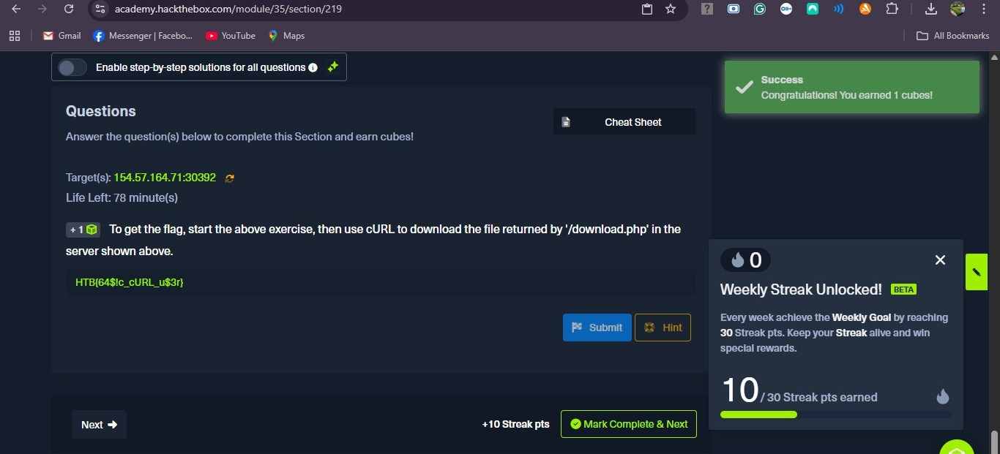
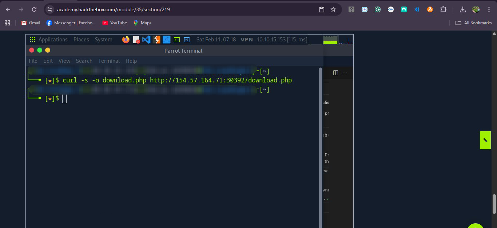
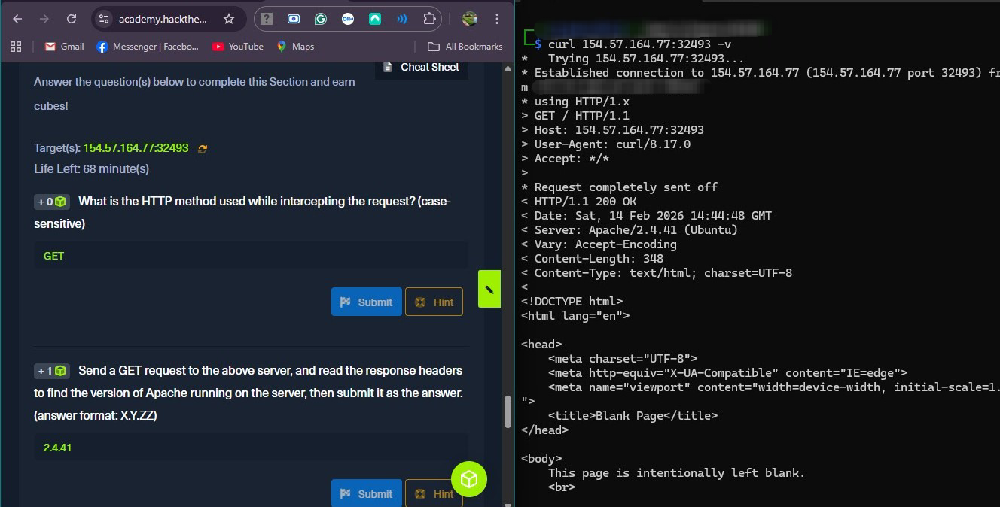

 In this writeup, I'll go over one of the fundamentals I've learned about web security: HTTP. HTTP is a protocol devices use to communicate to a website. The issue with HTTP is that it is easily readable, which is bad if your network traffic is intercepted. My goal for this lesson is to observe how HTTP requests are sent and how responses are received.
## cURL - What is cURL for?
* cURL is a command-line tool you can use to fetch some of the raw contents of a website, not to mention inspect raw HTTP traffic which is helpful when you're trying to identify issues with some HTTP requests or responses.

For this problem, I used -s and -o to download the requested download.php file containing the flag for the problem.

Here, I used curl -v to display the full HTTP request and full HTTP response. The HTTP request block start at the protocol indicated (HTTP/1.x) and the GET method. The HTTP response block starts with the server giving the status code 200 OK. The response also included the server's version which was asked in the second question.